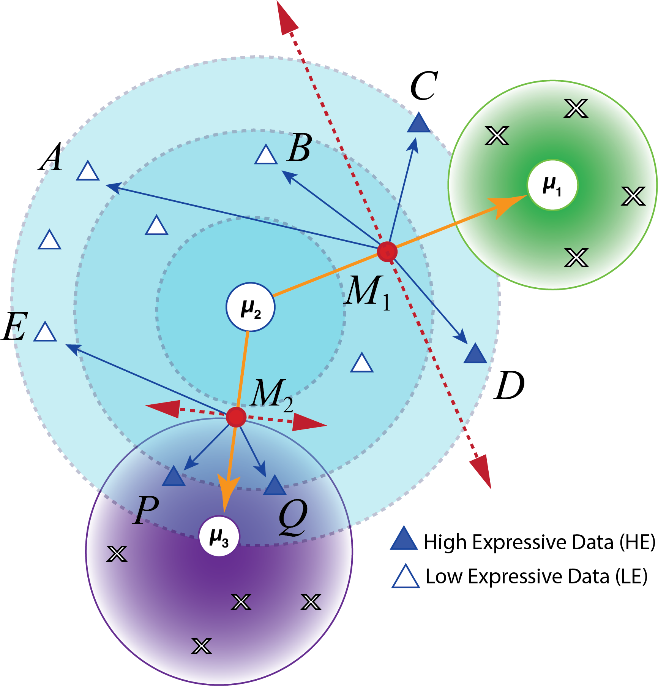

## What Data-Centric AI Can Do For k-means: a Faster, Robust kmeans-d
*k*means-d pushes __DCAI into the model building phase__ itself, observing whether benefits downstream can be as significant in a classical, well studied algorithm like *k*-means. *k*means-d achieves significant speedups (10X-300X) while preserving algorithmic accuracy. The key innovation classifies data points as __high expressive
(*HE*), impacting the objective function significantly, or low expressive (*LE*), with minimal influence__. By categorizing data points as *HE/LE*, kmeans-d extracts quality signals from data to improve scalability and reduce computational overhead. By rethinking k-means through a data lens, kmeans-d delivers superior efficiency without sacrificing properties like accuracy and convergence, paving the way for infusing data-centricity into other canonical algorithms.


### Data-Centric and Automated Relocation of Computation To Extract Quality Signals

The concept is illustrated in Fig. 1. Instead of doing the traditional data agnostic iteration, __data is treated as a first class citizen to proactively channelize significant computations towards HE data__ (as opposed to LE). Our paper show that LE does not affect the convergence or quality of results. Our experiments revealed that, real world data contains susbtantial amount of *HE* points, resulting in significant saving of compute, training resources (memory) and time.   


<div align="center">
  
  </br>
</div>

__Figure 1:__ Three clusters are denoted with their centers- $\mu_1$ (green), $\mu_2$ (skyblue) and $mu_3$ (purple). $M_1$ and $M_2$ are the midpoints of line segments $\overline{\mu_1\mu_2}$ and $\overline{\mu_2\mu_3}$. For clusters $\mu_1$ and $\mu_2$, only $C, D$ are valid *HE* points because they are oriented in the same direction as $\overrightarrow{\rm M_1\mu_1}$. For clusters $\mu_2$ and $\mu_3$, $P, Q$ are *HE* as they are oriented in same direction as $\overrightarrow{\rm M_2\mu_3}$

### Dependency

The code base is purely developed in C++. Both Kmeans and *k*means-d can be compiled direclty via standard C++ compiler (g++, clang etc.). However, Ball_Kmeans depends on the Eigen linear algebra library and requires linking to compile successfully. Following code snippets show exmaples of compiling the binary.

Note: We have already copied the Eigen header files (required for compiling) into the Github repository.

### Compiling Instructions

- Change the directory to src

```
cd src
```

- Link with the eigen header files by using the -I CPP compiler flag. If g++ is not installed in the system, it can be replaced with other c++ compilers available on the system. The following command will throw a warning upon execution, please ignore the warning.

```
g++ -std=c++11 -I ../eigen/ driver.cpp -o driver.out 
```

- Execute the newly compiled binary as follows:

```
./driver.out
```

- __Sample output:__ The following output will be printed on the screen. Due to githhub's file size restriction, only small to moderate size data is shared under Sample_Data. All datasets are available to download from UCI Machine Learning repository.

```
Reading the input from: ../Sample_Data/Breastcancer.csv
File reading: 35 MS
Data size: 569 X 30

Algo: KMeans, Clusters: 12, Threshold: 0.0001
Total KMeans time: 68 milliseconds

Algo: DCKM, Clusters: 12, Threshold: 0.0001
Total Kmeans-d time: 27 milliseconds

Algo: Ball Kmeans, Clusters: 12, Threshold: 0.0001
Total Ball Kmeans time: 155 milliseconds

#################################
#################################
Reading the input from: ../Sample_Data/CreditRisk.csv
File reading: 43 MS
Data size: 1000 X 20

Algo: KMeans, Clusters: 12, Threshold: 0.0001
Total KMeans time: 201 milliseconds

Algo: DCKM, Clusters: 12, Threshold: 0.0001
Total Kmeans-d time: 53 milliseconds

Algo: Ball Kmeans, Clusters: 12, Threshold: 0.0001
Total Ball Kmeans time: 196 milliseconds

#################################
#################################
Reading the input from: ../Sample_Data/census.csv
File reading: 1081 MS
Data size: 45222 X 6

Algo: KMeans, Clusters: 12, Threshold: 0.0001
Total KMeans time: 3844 milliseconds

Algo: DCKM, Clusters: 12, Threshold: 0.0001
Total Kmeans-d time: 2890 milliseconds

Algo: Ball Kmeans, Clusters: 12, Threshold: 0.0001
Total Ball Kmeans time: 22720 milliseconds

#################################
#################################
Reading the input from: ../Sample_Data/birch.csv
File reading: 650 MS
Data size: 100000 X 2

Algo: KMeans, Clusters: 12, Threshold: 0.0001
Total KMeans time: 2539 milliseconds

Algo: DCKM, Clusters: 12, Threshold: 0.0001
Total Kmeans-d time: 979 milliseconds

Algo: Ball Kmeans, Clusters: 12, Threshold: 0.0001
Total Ball Kmeans time: 12115 milliseconds

#################################
#################################%
```

### Raw Benchmark Results

Raw benchmark data is available as follows:

Experiment Type | Name | File Name
--- | --- | ---
Benchmarks on real data | __Random Seeding__ | [Results with random seeding](Data_Centric_KMeans/blob/main/results_benchmark_real_data/benchmark_real_avg_runs.csv)
Benchmarks on real data | $\textbf{k++}$ __Seeding__ | [Results with $k++$ seeding](results_benchmark_real_data/benchmark_real_avg_runs.csv)
Large number of Clusters | __Clustering Experiments__ | [Clustering experiments](results_synthetic_data/benchmark_clus_avg_runs.csv) 
Large dimensions | __Dimensionality Experiments__| [Dimensionality experiments](results_synthetic_data/benchmark_dims_avg_runs.csv)
Big synthetic data | __Scalability Experiments__ | [Scalability experiments](results_synthetic_data/benchmark_scal_avg_runs.csv)
Doubling experiments | __Savings in Computation__ | [Doubling Clusters](results_doubling_exp/doubling_clusters_avg.csv), [Doubling Data Proportion](results_doubling_exp/doubling_clusters_avg.csv)
Ablation experiments | __Isolating Effect of Parallelism__ | [With vectorization](results_doubling_exp/ablation_with_vec_avg.csv), [No vectorization](results_doubling_exp/ablation_with_vec_avg.csv)

#### Related Work

Check out [Paper 1](https://www.sciencedirect.com/science/article/pii/S2352711021001771) | [Paper 2](https://datacentricai.org/neurips21/papers/145_CameraReady_Poster_DCAI_DataExpressiveness_2021.pdf) | [R Package](https://cran.r-project.org/web/packages/DCEM/vignettes/DCEM.html) | to learn more about previous work.

### Contact Details

For help with compiling/running, or reporting issues-please let us know at __parishar__[at]__iu__[dot]__edu__. We would be happy to help you out.


